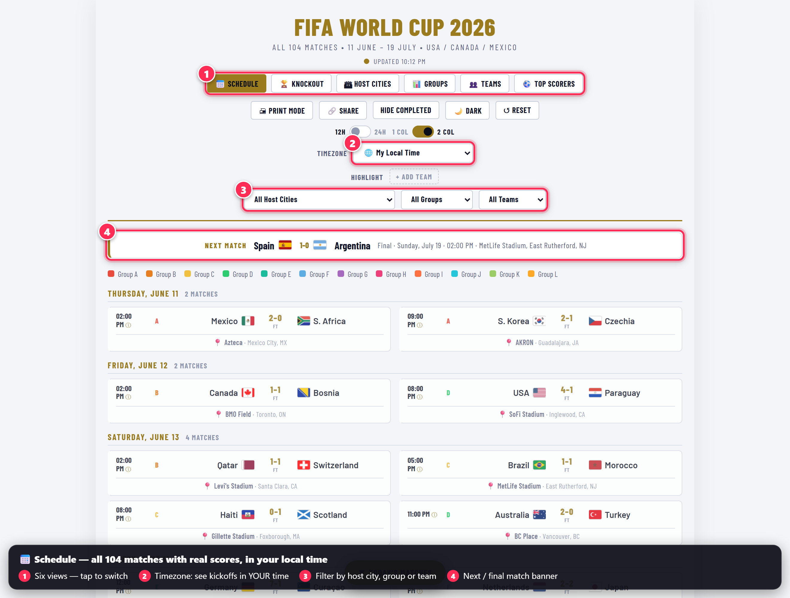
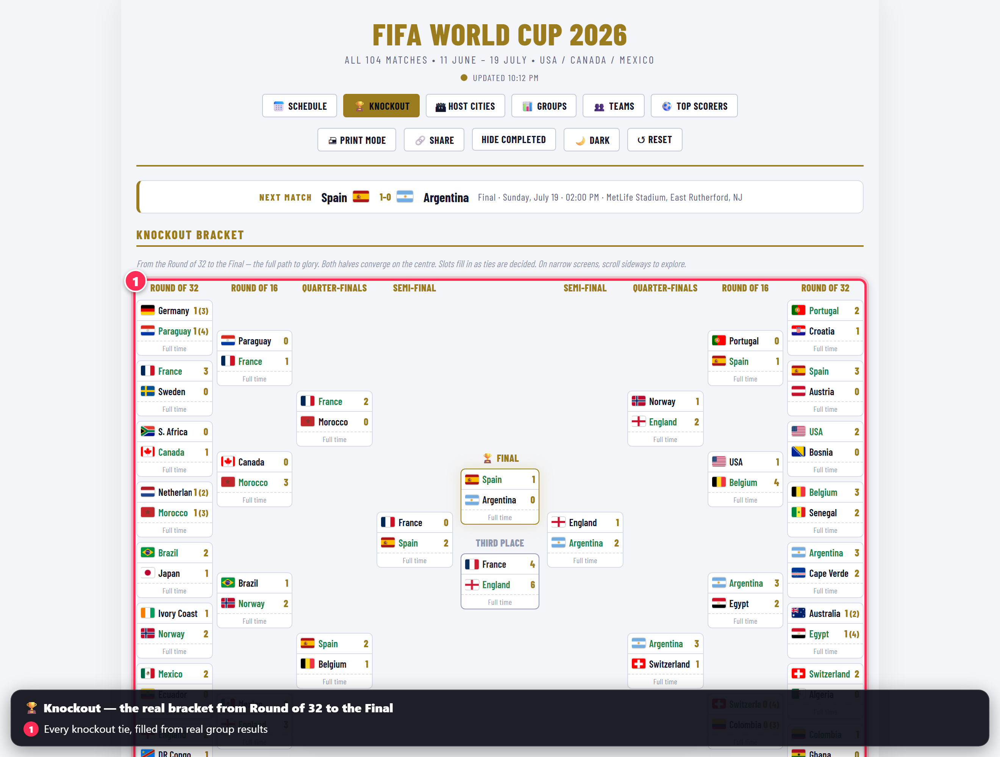
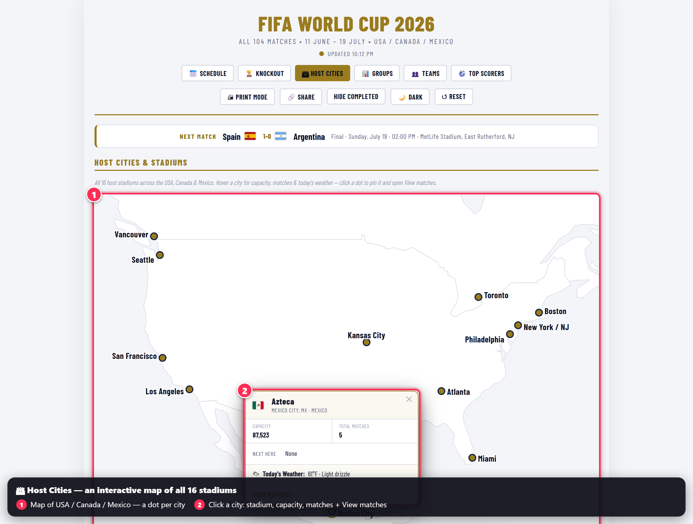
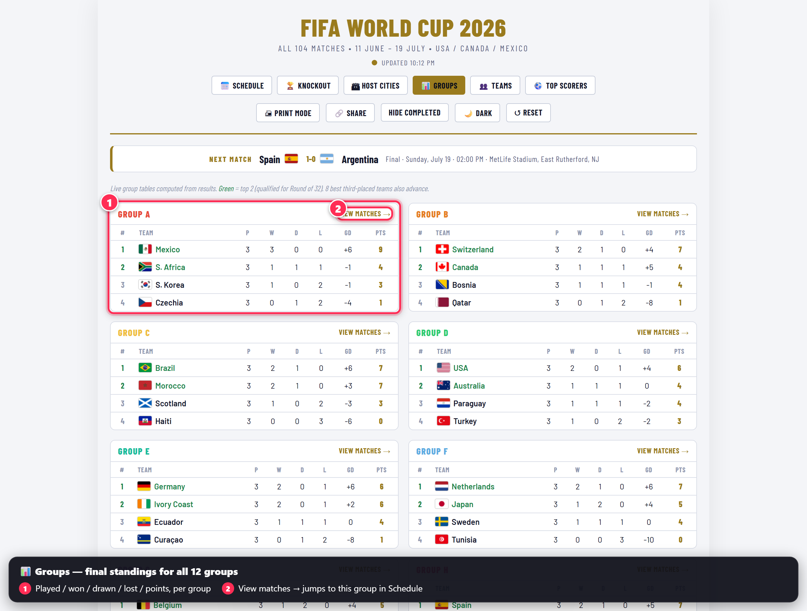
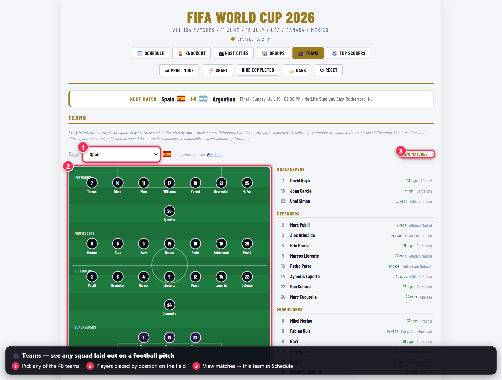
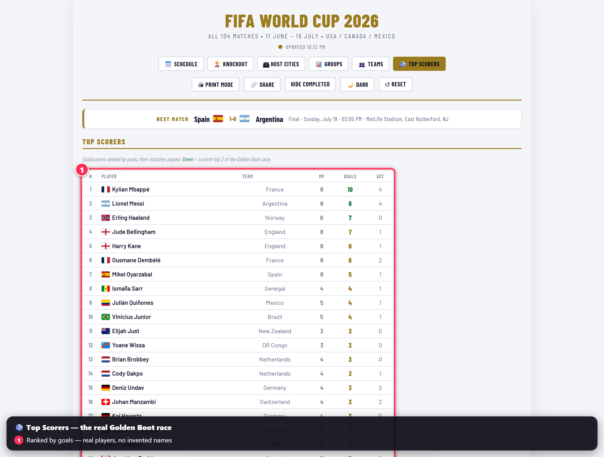

# ⚽ FIFA World Cup 2026 — Live Schedule & Scores

A fast, single-page website for following the **2026 FIFA World Cup** across the USA,
Canada & Mexico — every match, real scores, group tables, the knockout bracket, squads,
and top scorers — all shown in **your own local time**.

> ### ▶️ Open the live site: **https://shajusachin.github.io/fwc26/**
>
> No install, no login, no app to download. Just open the link on your phone, tablet, or
> computer.

**Everything you see is real tournament data.** Scores, goalscorers and standings come
from public football data providers — nothing on this site is made up or simulated.

---

## 👀 Take the tour

The site has **six tabs** across the top. Here's what each one does — the red numbered
callouts on each picture match the notes underneath.

### 📅 Schedule — every match, in your time



All 104 matches, grouped by day, each with the real final score, the venue, and a group
colour tag.

1. **Six views** — tap these to switch between Schedule, Knockout, Host Cities, Groups,
   Teams and Top Scorers.
2. **Timezone** — pick any zone (or "My Local Time") and every kickoff instantly
   converts. Toggle 12h/24h and 1- or 2-column layouts too.
3. **Filters** — narrow the list down to a single **host city**, **group**, or **team**.
4. **Next match banner** — shows the upcoming fixture (here, the completed **Final**).

### 🏆 Knockout — the road to the Final



The complete bracket on one screen, from the Round of 32 all the way to the **Final** in
the middle. Both sides of the draw flow inward so you can trace each team's path. Every
slot is filled from the **real group results** — never guessed.

### 🏟 Host Cities — an interactive map



A map of all **16 host stadiums** across the three countries.

1. **The map** — one dot per host city.
2. **Click a dot** to pin a card showing the **stadium name, capacity, number of
   matches, today's weather**, and a **View matches** link that jumps straight to that
   city's games on the Schedule.

### 📊 Groups — final standings



Live tables for all **12 groups**, worked out automatically from the results.

1. Each table shows **played, won, drawn, lost, goal difference and points**. Teams in
   green qualified for the knockouts.
2. **View matches →** takes you to that group's fixtures on the Schedule.

### 👥 Teams — every squad on a football pitch



Great for casual fans — see who's who without knowing the game.

1. **Pick any of the 48 teams** from the dropdown.
2. The **26-player squad is laid out on a pitch** by role band — goalkeepers, defenders,
   midfielders, forwards. (Real line-ups aren't published as open data, so we show
   honest role bands, never an invented formation.)
3. **View matches →** shows that team's games. Each player's **club, caps & shirt
   number** are listed in the roster beside the pitch.

### ⚽ Top Scorers — the Golden Boot race



Every goalscorer ranked by goals, then matches played. These are **real players** — when
a goal's scorer isn't named in the public data, we leave it blank rather than invent one.

---

## 🚀 Quick tips

- **Set your timezone** first (top bar) — everything follows it.
- **Share any view:** apply filters, hit **🔗 Share**, and it copies a direct link
  (e.g. `?team=Brazil`) to your clipboard.
- **Tap a finished match** to see its goal-by-goal timeline (scorer + minute).
- **🖨 Print Mode** gives you a clean, paper-friendly layout.
- **🌙 Dark** toggles a dark theme.

---

## 🔄 Is the data really live?

Yes. The page loads instantly with a recent snapshot built in, then quietly pulls the
**latest data** in the background:

- A scheduled **GitHub Action** (`.github/workflows/refresh-data.yml`) fetches fresh
  match data and saves it to the repo automatically.
- The page reads that data **straight from GitHub**, so new scores appear **without the
  site needing to redeploy**. A small pill in the header tells you whether you're seeing
  **live** or **snapshot** data.
- Stadium weather is fetched on demand from a free weather service when you open a
  host-city card.

---

## 🛠 Run it locally (optional)

You only need [Node.js](https://nodejs.org/) (v18+). No build step, no dependencies.

```bash
# clone the repo
git clone https://github.com/shajusachin/fwc26.git
cd fwc26

# start a tiny local server
node scripts/serve.mjs
# → open http://localhost:8099/
```

> Opening `index.html` directly as a `file://` works too, but serving over `http://`
> lets the live data + weather behave exactly like the hosted site.

### Refresh the data yourself

```bash
# rebuild the feed from the existing raw files (no network needed):
node scripts/refresh.mjs

# pull genuinely fresh data from the provider (needs a free API token):
FOOTBALL_DATA_TOKEN=your_token node scripts/refresh.mjs
```

Get a free token at [football-data.org](https://www.football-data.org/). To enable the
automated refresh on your own fork, add the token as a repository secret named
`FOOTBALL_DATA_TOKEN` (**Settings → Secrets and variables → Actions**).

---

## 📁 Project layout

```
index.html              The entire app — one self-contained page
data-compact.json       Live feed the page reads (fixtures + scorers + match details)
squads.json             Official 26-player squads for all 48 teams (role-tagged)
map.json                North America map outline + stadium dot coordinates (Host Cities)
docs/images/            Annotated screenshots used in this README
*-embed.js              Baked-in fallback snapshot (loads instantly / offline)
data.json, scorers.json, match-details.json, fixtures.json   Raw, human-readable data
scripts/refresh.mjs     Builds the feed (live from the API, or offline from raw files)
scripts/build-squads.mjs  One-off builder for squads.json (parses Wikipedia squads)
scripts/build-map.mjs   One-off builder for map.json (Natural Earth outline + stadiums)
scripts/serve.mjs       Minimal local static server
.github/workflows/      Scheduled data-refresh + GitHub Pages deploy Actions
```

---

## 🙏 Credits & attribution

- **Match & scorer data:** [football-data.org](https://www.football-data.org/) and
  [openfootball](https://github.com/openfootball) (real per-match goals)
- **Squad rosters:** [Wikipedia — 2026 FIFA World Cup squads](https://en.wikipedia.org/wiki/2026_FIFA_World_Cup_squads) (CC BY-SA)
- **Team flags:** [flagcdn.com](https://flagcdn.com/)
- **Live stadium weather:** [Open-Meteo](https://open-meteo.com/)
- **Map outline:** [Natural Earth](https://www.naturalearthdata.com/) (public domain)
- **Original inspiration:** the excellent
  [**Kingdoggydog/worldcup2026**](https://github.com/Kingdoggydog/worldcup2026)
  project — the OG that sparked this build.

---

## 📝 About

A personal passion project — built and maintained by **Shaju** for the love of the
game and as part of learning the art of Vibe Coding and GitHub Copilot. Contributions,
ideas, and bug reports are welcome via Issues.

**Disclaimer:** This is an unofficial fan-made project. It is **not affiliated with,
endorsed by, or associated with FIFA** or any official World Cup body. All team and
competition names belong to their respective owners.

## © Copyright

Copyright © 2026 shajusachin. **All Rights Reserved.** See [COPYRIGHT](COPYRIGHT).

This repository is public for viewing only. No part may be copied, forked, or
reused without prior written permission.
